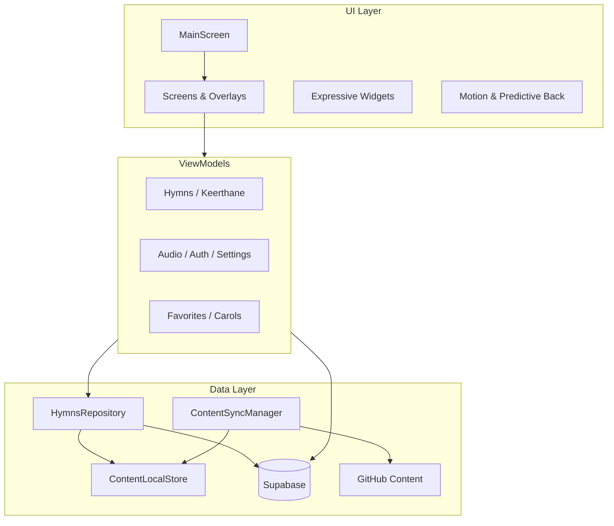

<p align="center">
  <strong style="font-size: 3rem;">🎵</strong>
</p>

<h1 align="center">CSI Hymns Book</h1>

<p align="center">
  A native Android hymn &amp; keerthane companion — rebuilt in Kotlin and Jetpack Compose with Material 3 Expressive design, offline-first lyrics, and cloud sync.
</p>

<p align="center">
  
  
  
  
  
  
</p>

---

## Overview

**CSI Hymns Book** is the Android-native rewrite of the CSI Hymns & Lyrics app (formerly Flutter). It helps congregations browse hymns and keerthanes, read bilingual lyrics, flip through stanzas like a book, play MIDI audio, cast to Chromecast, manage favorites and custom categories, follow the Order of Service, and celebrate Christmas with carols — all with a modern, tactile UI.

This repository is the **Kotlin / Jetpack Compose** native rewrite of the original CSI Hymns & Lyrics app.

---

## Highlights

| | |
|---|---|
| **Offline-first** | Bundled JSON seed + local cache; background sync from GitHub |
| **Expressive UI** | M3 Expressive components, haptics, predictive back, page-curl lyrics |
| **Cloud-backed** | Supabase auth, favorites, custom categories, remote `app_config` |
| **Audio & Cast** | Media3 ExoPlayer in-app player + Google Cast support |
| **Community** | Jira lyric correction tickets, Christmas carol contributions |

---

## Features

### Hymns & Keerthane
- Search and sort by number, title, or meter
- Kannada / English lyrics toggle
- Adjustable font size and reading progress resume
- Favorites with cloud sync when signed in
- Report lyric issues → Jira tickets

### Lyrics experience
- **Scroll mode** — classic vertical reading
- **Page Flip mode** — finger-driven 3D page curl with dynamic pagination
- Remote flag to show/hide Page Flip in settings

### Order of Service
- Bilingual card grid (Regular & Festival)
- Full-screen reader with jump-to-page navigation

### Categories & Collections
- Recent songs, occasion categories, and custom collections
- Guest users can create up to 5 custom categories
- Add/remove hymns and keerthanes from collections

### Christmas Mode
- Festive theming, snowfall landing screen
- Community Christmas carols (lyrics or PDF)
- Authenticated users can contribute carols

### Audio & Cast
- Built-in expressive audio player (play, seek, speed, loop)
- Chromecast streaming when enabled via remote config

### Account & Settings
- Google Sign-In via Supabase
- Light / Dark / System theme, AMOLED black, 21 accent colors
- Force-update gate, changelog, privacy policy, onboarding

---

## Screenshots

> Add device screenshots here after your next release build.

| Hymns | Detail | Page Flip |
|:---:|:---:|:---:|
| *placeholder* | *placeholder* | *placeholder* |

---

## Architecture



**Pattern:** MVVM · `ViewModel` + `StateFlow` · Repository · Offline-first with reactive `ContentUpdateBus`

---

## Tech stack

| Category | Libraries |
|----------|-----------|
| UI | Jetpack Compose, Material 3 Expressive `1.5.0-alpha21`, Navigation Compose |
| Architecture | AndroidX Lifecycle, ViewModel Compose |
| Backend | Supabase Kotlin (Auth, PostgREST, Storage) |
| Audio | AndroidX Media3 ExoPlayer |
| Cast | Google Play Services Cast Framework |
| Network | OkHttp, Ktor, kotlinx-serialization |
| Local storage | DataStore Preferences, app-private JSON cache |
| Analytics | PostHog Android |
| Build | AGP 9.x, Kotlin 2.3, Gradle Version Catalog |

---

## Project structure

```
app/src/main/java/com/reyzie/hymns/
├── MainActivity.kt          # Entry, theme, Supabase init, OAuth deeplinks
├── cast/                    # Chromecast service & options provider
├── data/                    # Repositories, sync, Supabase, Jira, local store
├── ui/
│   ├── screens/             # Compose screens (Hymns, Detail, Settings, …)
│   ├── viewmodels/          # Shared ViewModels
│   ├── widgets/             # Page flip, button groups, cast sheet, …
│   ├── motion/              # Overlay transitions, predictive back
│   ├── navigation/          # Tab routes
│   └── theme/               # M3 Expressive theme tokens
└── utils/                   # Haptics, motion specs, expressive modifiers

app/src/main/assets/
├── changelog.json           # In-app release history
└── content/                 # Bundled hymns, keerthane, order-of-service seed data
```

---

## Getting started

### Prerequisites

- **Android Studio** Ladybug or newer (or compatible IDE)
- **JDK 11+**
- **Android SDK** with API 37 (compile) and API 36 (target)
- A physical device or emulator running **API 26+**

### Clone & configure

```bash
git clone <your-repo-url>
cd CSI-Android-Native
```

Create `local.properties` in the project root (gitignored) with your SDK path and API keys:

```properties
sdk.dir=/path/to/Android/sdk

# Supabase (required for auth, favorites, config, tickets)
SUPABASE_URL=https://your-project.supabase.co
SUPABASE_ANON_KEY=your-anon-key

# PostHog (optional — analytics)
POSTHOG_API_KEY=
POSTHOG_HOST=https://us.i.posthog.com

# Jira (optional — lyric correction tickets)
JIRA_URL=https://your-domain.atlassian.net
JIRA_EMAIL=you@example.com
JIRA_API_TOKEN=
JIRA_PROJECT_KEY=CSI
```

> Never commit `local.properties` or real credentials. Keys are injected at build time via `BuildConfig`.

### Build & run

```bash
./gradlew :app:assembleDebug
```

Or open the project in Android Studio and run the **app** configuration on a device.

### Release build

```bash
./gradlew :app:assembleRelease
```

Configure signing in `app/build.gradle.kts` before publishing to Play Store.

---

## Remote configuration

The app reads `app_config` rows from Supabase at launch. Supported keys include:

| Key | Purpose |
|-----|---------|
| `is_christmas_time` | Enable Christmas mode remotely |
| `force_update_*` | Block old builds with update dialog |
| `cast_enabled` | Show Cast controls |
| `cast_app_id` / `cast_receiver_url` | Chromecast receiver |
| `page_flip_visible` | Show Page Flip toggle in Settings |

---

## Migration from Flutter

This project is a **full native rewrite**, not a Flutter embedding. Feature parity follows the Flutter **4.2.x** lineage documented in `app/src/main/assets/changelog.json`.

| Ported | Not yet in native |
|--------|-------------------|
| Hymns, Keerthane, Favorites, OOS | Jump to Meter selector |
| Auth (Google), Custom categories | Email/password auth |
| Christmas mode & carols | Occasion category song lists |
| Jira tickets, Cast, Page flip | OneSignal push |
| Offline sync, Force update | In-app Play update flow |

---

## Contributing

1. Fork the repository
2. Create a feature branch (`git checkout -b feature/my-change`)
3. Commit with a clear message
4. Open a pull request

Please keep changes focused and match existing Compose / MVVM conventions.

---

## License

Private / personal project. Add your license here if you plan to open-source.

---

## Acknowledgements

- CSI hymn & keerthane lyric contributors and the worship community
- [Supabase](https://supabase.com) · [Jetpack Compose](https://developer.android.com/compose) · [Material Design 3](https://m3.material.io)
- The original Flutter app that inspired this rewrite

---

<p align="center">
  <sub>Built with care for congregational worship · Kotlin Native · v1.0</sub>
</p>
