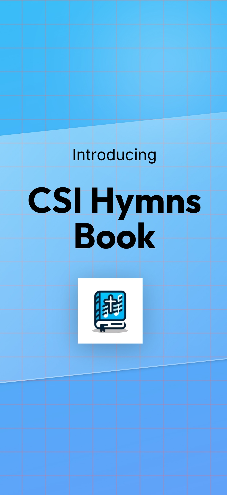
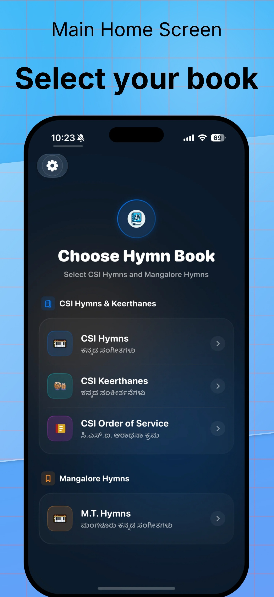
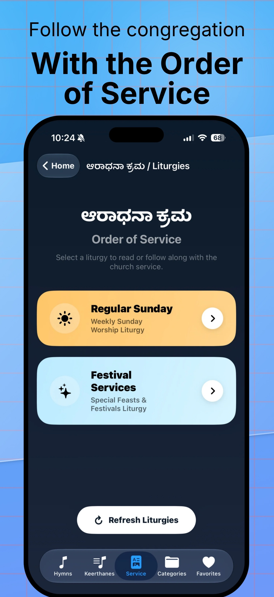
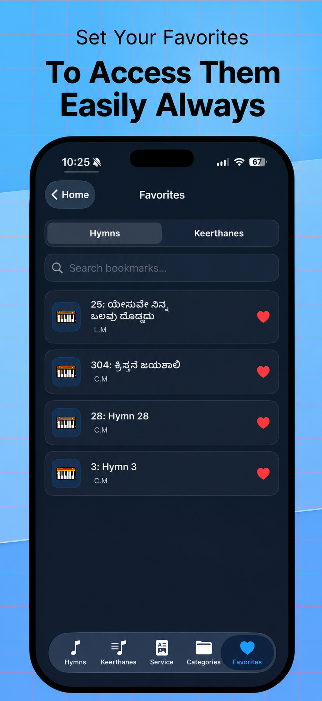
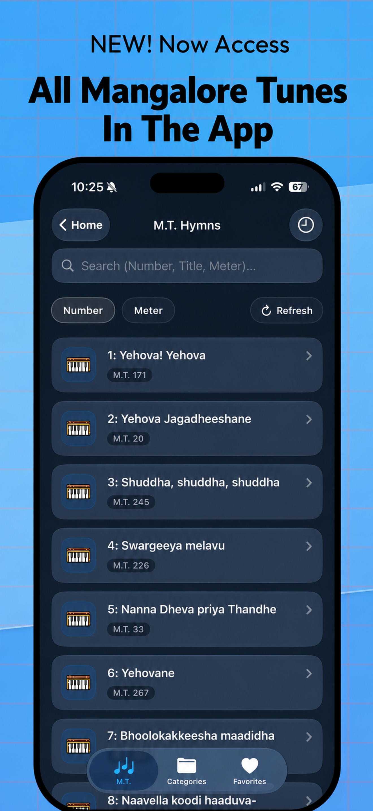
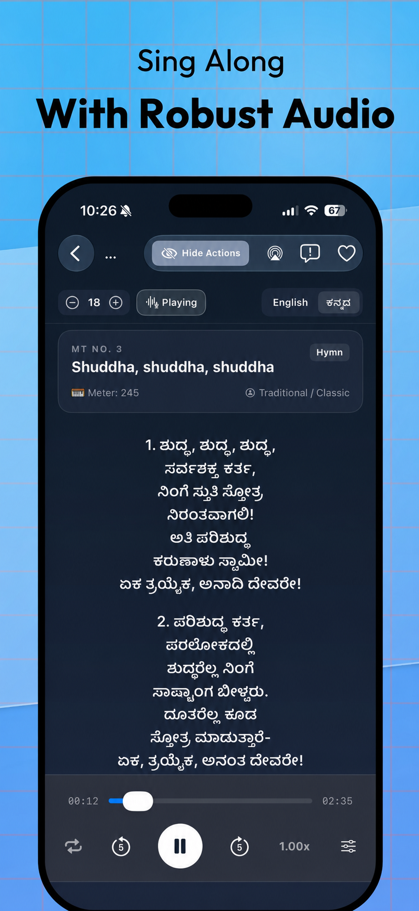
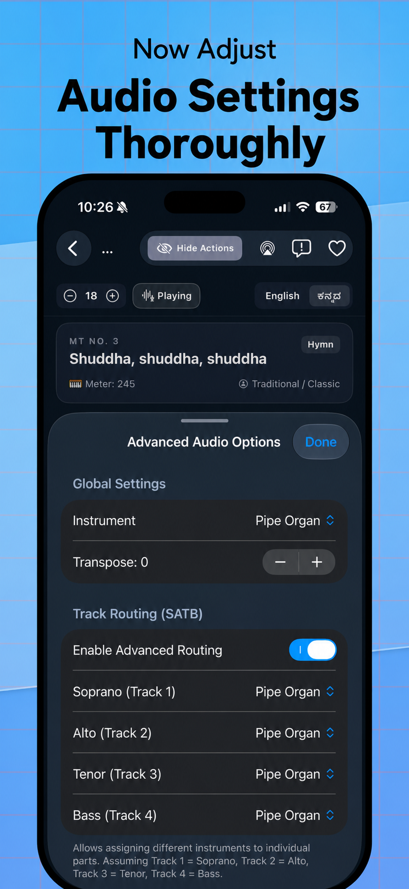
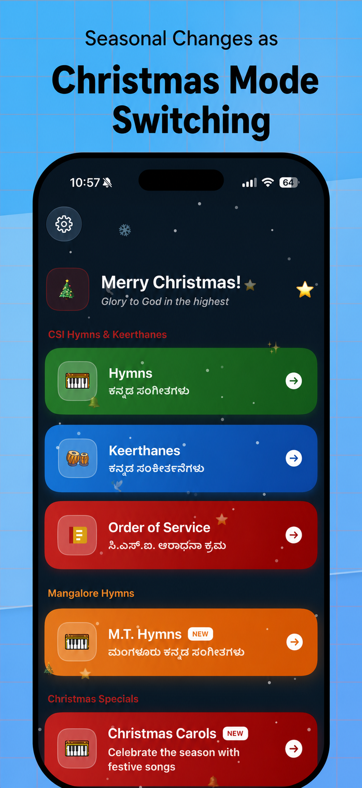
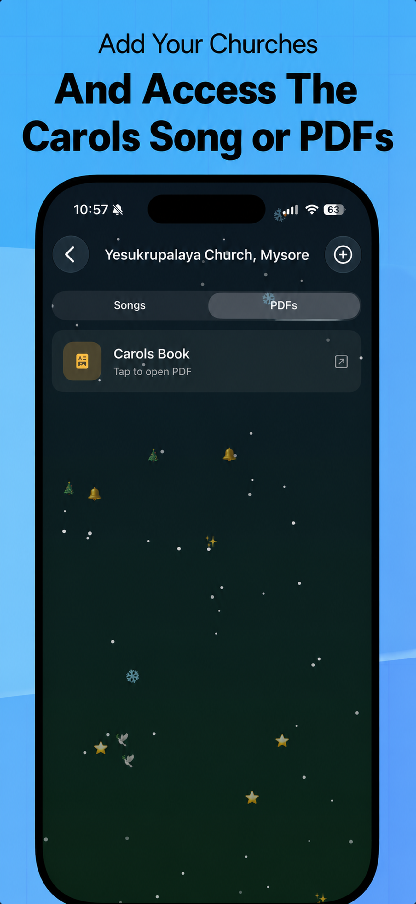
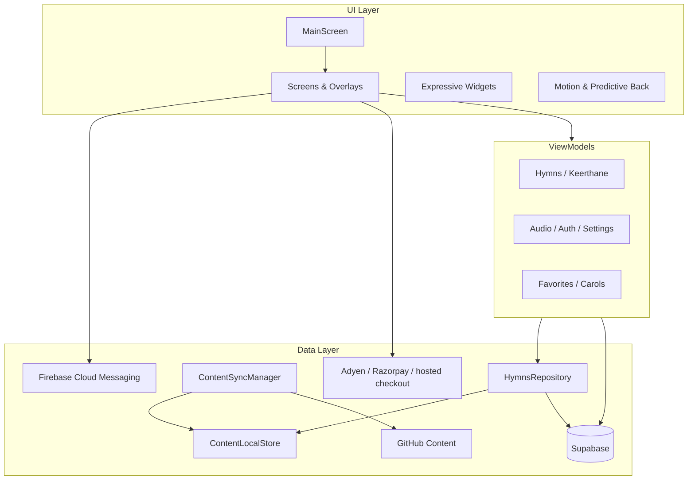

<p align="center">
  
</p>

<h1 align="center">CSI Hymns Book</h1>

<p align="center">
  A native Android hymn &amp; keerthane companion — rebuilt in Kotlin and Jetpack Compose with Material 3 Expressive design, offline-first lyrics, and cloud sync.
</p>

<p align="center">
  
  
  
  
  
  
</p>

---

## Overview

**CSI Hymns Book** is the Android-native rewrite of the CSI Hymns & Lyrics app (formerly Flutter). It helps congregations browse CSI hymns, keerthanes, and Mangalore Tunes (M.T.) hymns; read bilingual lyrics; flip through stanzas like a book; play MIDI or fallback audio; cast to Chromecast; manage favorites and custom categories; follow the Order of Service; receive announcements; and celebrate Christmas with community carols — all with a modern, tactile UI.

This repository is the **Kotlin / Jetpack Compose** native rewrite of the original CSI Hymns & Lyrics app. Current Play/build version is **5.1.2** (`versionCode` 34).

---

## Highlights

| | |
|---|---|
| **Offline-first** | Bundled JSON seed + local cache; background sync from GitHub (hymns, keerthane, Order of Service, M.T. hymns) |
| **Expressive UI** | M3 Expressive components, haptics, predictive back, page-curl lyrics |
| **Cloud-backed** | Supabase auth, favorites, custom categories, remote `app_config` |
| **Audio & Cast** | Media3 ExoPlayer + MIDI playback (transpose, SATB routing, tune selector) and Google Cast |
| **Notifications** | Firebase Cloud Messaging with in-app broadcasts and version-targeted announcements |
| **Community** | Jira lyric tickets (report, inbox, replies), Christmas carol contributions, optional donations |

---

## Features

### Hymns & Keerthane
- Search and sort by number, title, or meter
- **Jump to Meter** (and Jump to MT Tune on Mangalore Tunes) to scroll the list instantly
- Kannada / English lyrics toggle
- Adjustable font size and reading progress resume
- Favorites with cloud sync when signed in (guest stars merge into the account on login)
- Report lyric issues → Jira tickets; review submitted tickets (status, replies) from the sidebar
- Acknowledgement dialog on launch when a lyric ticket is marked resolved
- Dynamic page selection state preservation (remembers your tab choices without page resets)

### Mangalore Tunes (M.T.)
- Dedicated M.T. Hymns section (enabled via remote `is_mangalore_hymns_enabled`)
- Lyrics, search, categories, and favorites for the M.T. book
- Section selector to switch between CSI Hymns & Keerthanes and M.T. Hymns

### Lyrics experience
- **Scroll mode** — classic vertical reading
- **Page Flip mode** — finger-driven 3D page curl with dynamic pagination
- Remote flag to show/hide Page Flip in settings
- **Hide/Show Controls** on hymn detail for distraction-free reading (persists across songs and orientation)
- Landscape: lyrics stay full-height with a collapsible right-side controls panel; controls also collapse automatically when playback starts unless you expand them again

### Order of Service
- Bilingual card grid (Regular & Festival)
- Full-screen reader with jump-to-page navigation

### Categories & Collections
- Recent songs, occasion category song lists, and custom collections
- Guest users can create up to 5 custom categories
- Add/remove hymns and keerthanes from collections

### Christmas Mode
- Festive theming and a snowfall landing screen with cards for hymns, keerthane, community carols, and M.T. (when enabled)
- The Keerthane tab is omitted from the bottom bar during Christmas; it remains reachable from the landing screen
- Community Christmas carols (lyrics or PDF)
- Authenticated users can contribute carols

### Audio & Cast
- Built-in expressive audio player (play, seek, speed, loop); playback pauses when the screen turns off
- MIDI playback with live transpose and independent SATB instrument routing
- Default MIDI instrument in Settings (piano, organs, strings, bells, choir)
- Tune selector (grid / dropdown) for multiple tune or meter variations
- Automatic MIDI when matching files exist on GitHub; `.ogg` fallback unless disabled remotely
- When no audio is available, users can contribute a MIDI or audio file as a Jira ticket
- Chromecast streaming when enabled via remote config
- High-precision playback speed control (0.5x–1.5x) using micro-intervals (+/- 0.05x) and a reset control
- Byte-level raw MIDI tempo metadata scaling (`0xFF 0x51 0x03` modification) for smooth tempo shifts without post-synth audio distortion
- Progressive remote range-based transitions (`midi_hymns_ranges` and `midi_keerthanes_ranges`) from `.ogg` to `.mid`

### Notifications & announcements
- Firebase Cloud Messaging for push notifications (image-capable BigPicture style)
- Runtime notification permission on Android 13+
- In-app broadcasts, including version-targeted announcements

### Donations
- Optional in-app donations (INR / USD) when payments are enabled remotely
- Adyen Drop-in and hosted checkout; Razorpay when that gateway is enabled
- Return deep links: `csihymns://donation_result` and `https://csihymns.app/donation_result`

### Account & Settings
- Google Sign-In and email/password (sign in, sign up, reset) via Supabase
- Edit profile when signed in
- Light / Dark / System theme, AMOLED black, 22 accent colors
- Force-update gate, Play In-App Updates from Settings, changelog, privacy policy, onboarding
- Sidebar link to **Worship Companion**, a separate praise-and-worship lyrics app
- Safe navigation drawer Sign-In triggers and crash-free dynamic `AuthScreen` stacked overlays
- Optimized class-level Proguard rules for serialization and model parsing, enabling full R8 code shrinking and memory reductions

---

## Screenshots

<p align="center">
  
  
  
</p>
<p align="center">
  
  
  
</p>
<p align="center">
  
  
  
</p>

---

## Architecture


```mermaid
flowchart TB
    subgraph UI["UI Layer"]
        MS[MainScreen]
        Screens[Screens & Overlays]
        Widgets[Expressive Widgets]
        Motion[Motion & Predictive Back]
    end

    subgraph VM["ViewModels"]
        HVM[Hymns / Keerthane]
        AVM[Audio / Auth / Settings]
        FVM[Favorites / Carols]
    end

    subgraph Data["Data Layer"]
        Repo[HymnsRepository]
        CLS[ContentLocalStore]
        CSM[ContentSyncManager]
        SB[(Supabase)]
        GH[GitHub Content]
        FCM[Firebase Cloud Messaging]
        Pay[Adyen / Razorpay / hosted checkout]
    end

    MS --> Screens
    Screens --> VM
    VM --> Repo
    Repo --> CLS
    CSM --> CLS
    CSM --> GH
    Repo --> SB
    VM --> SB
    Screens --> FCM
    Screens --> Pay
```

**Pattern:** MVVM · `ViewModel` + `StateFlow` · Repository · Offline-first with reactive `ContentUpdateBus`

---

## Tech stack

| Category | Libraries |
|----------|-----------|
| UI | Jetpack Compose, Material 3 Expressive `1.5.0-alpha23`, Navigation Compose |
| Architecture | AndroidX Lifecycle, ViewModel Compose |
| Backend | Supabase Kotlin (Auth, PostgREST, Storage) |
| Audio | AndroidX Media3 ExoPlayer |
| Cast | Google Play Services Cast Framework |
| Payments | Adyen Drop-in `5.19.0` |
| Push & analytics | Firebase Cloud Messaging, Firebase Analytics, PostHog Android |
| Updates | Play In-App Updates |
| Network | OkHttp, Ktor, kotlinx-serialization |
| Local storage | DataStore Preferences, app-private JSON cache |
| Build | AGP `9.3.0-rc01`, Kotlin `2.4.0`, Gradle `9.6.1`, Version Catalog |

---

## Project structure

```
app/src/main/java/com/reyzie/hymns/
├── MainActivity.kt          # Entry, theme, Supabase init, OAuth / donation deeplinks
├── HymnsApplication.kt      # FCM topic subscription
├── cast/                    # Chromecast service & options provider
├── carols/                  # Community Christmas carols (data, sync, UI)
├── data/                    # Repositories, sync, Supabase, FCM, payments, Jira, local store
├── ui/
│   ├── screens/             # Compose screens (Hymns, Detail, Settings, Donations, …)
│   ├── viewmodels/          # Shared ViewModels
│   ├── widgets/             # Page flip, jump-to-meter, button groups, cast sheet, …
│   ├── motion/              # Overlay transitions, predictive back
│   ├── navigation/          # Tab routes
│   └── theme/               # M3 Expressive theme tokens
└── utils/                   # Haptics, motion specs, expressive modifiers

app/src/main/assets/
├── changelog.json           # In-app release history
└── content/                 # Bundled hymns, keerthane, M.T. hymns, order-of-service seed data

ci/                          # Jenkins helpers (version, changelog, Slack/Telegram notify)
fastlane/                    # Google Play upload lane
Jenkinsfile                  # Release APK + AAB pipeline
```

---

## Getting started

### Prerequisites

- A recent **Android Studio** that supports **AGP 9.x**
- **JDK 17+** (the Gradle daemon toolchain is pinned to **21**)
- **Android SDK** with API 37 (compile) and API 36 (target)
- A physical device or emulator running **API 26+**

### Clone & configure

```bash
git clone https://github.com/CSI-Hymns-Book/CSI-Hymns-Android-Native.git
cd CSI-Hymns-Android-Native
```

Create `local.properties` in the project root (gitignored) with your SDK path and API keys:

```properties
sdk.dir=/path/to/Android/sdk

# Supabase (required for auth, favorites, config, tickets)
SUPABASE_URL=https://your-project.supabase.co
SUPABASE_ANON_KEY=your-anon-key

# PostHog (optional — analytics)
POSTHOG_API_KEY=
POSTHOG_HOST=https://us.i.posthog.com

# Jira (optional — lyric correction tickets)
JIRA_URL=https://your-domain.atlassian.net
JIRA_EMAIL=you@example.com
JIRA_API_TOKEN=
JIRA_PROJECT_KEY=CSI

# Adyen (optional — donations; defaults to TEST placeholders)
ADYEN_CLIENT_KEY=
ADYEN_ENVIRONMENT=TEST
```

Firebase Cloud Messaging and Firebase Analytics use `app/google-services.json` (Google Services Gradle plugin).

For Google / OAuth sign-in, register these redirect URIs in the Supabase Auth dashboard (both are declared in `AndroidManifest.xml`):

- `com.reyzie.hymns://callback`
- `io.supabase.flutter://callback` (legacy Flutter scheme, still accepted)

> Never commit `local.properties`, `keystore.properties`, or real credentials. Keys are injected at build time via `BuildConfig`.

### Build & run

```bash
./gradlew :app:assembleDebug
```

Or open the project in Android Studio and run the **app** configuration on a device.

### Tests

```bash
./gradlew :app:test
```

Unit tests cover content JSON parsing/patches, Order of Service sync payloads, favorites merge-on-login, and custom-category migration.

### Release build

```bash
./gradlew :app:assembleRelease
./gradlew :app:bundleRelease
```

Copy `keystore.properties.example` to `keystore.properties` and fill in the Play upload keystore path and passwords. Release signing is applied automatically when that file points at a valid keystore. CI builds both the APK (`assembleRelease`) and the Play App Bundle (`bundleRelease`).

---

## CI & Play uploads

Jenkins (`Jenkinsfile`) runs on `main` and `dev`: assemble a signed release APK and AAB, verify signatures, optionally upload the AAB to Google Play via Fastlane, and notify Slack/Telegram.

| Play track | Fastlane behavior |
|------------|-------------------|
| `open` | Open Testing (`beta`), `release_status=completed` |
| `production` | Production **draft** (requires `CONFIRM_PRODUCTION=true`; promote in Play Console) |

Ruby/Fastlane setup, helper scripts, and local metadata checks are documented in [`ci/README.md`](ci/README.md). Do not commit `keystore.properties`, keystores, or Play service-account JSON.

---

## Remote configuration

The app reads `app_config` rows from Supabase at launch. Supported keys include:

| Key | Purpose |
|-----|---------|
| `is_christmas_time` | Enable Christmas mode remotely |
| `is_mangalore_hymns_enabled` | Show the Mangalore Tunes section |
| `force_update_*` | Block old builds with update dialog |
| `cast_enabled` | Show Cast controls |
| `cast_app_id` / `cast_receiver_url` | Chromecast receiver |
| `page_flip_visible` | Show Page Flip toggle in Settings |
| `midi_hymns_ranges` / `midi_keerthanes_ranges` | Progressive MIDI rollout ranges |
| `disable_ogg_fallback` | Disable `.ogg` fallback: `hymns`, `keerthane`, or `both` |
| `audio_backup_url` | Alternate audio host |
| `payments_enabled` / `is_adyen_enabled` / `is_razorpay_enabled` | Donation gateways |

Authorized maintainers can also manage announcements and selected config from in-app Admin Controls. Sensitive keys (tokens, admin lists, passcodes) stay in Supabase and are not documented here.

---

## Migration from Flutter

This project is a **full native rewrite**, not a Flutter embedding. Feature parity follows the Flutter **4.2.x** lineage documented in `app/src/main/assets/changelog.json`. Items previously listed as missing are now in the native app:

| Now in native | Notes |
|---------------|--------|
| Hymns, Keerthane, Favorites, Order of Service | Including M.T. Hymns |
| Auth | Google and email/password |
| Custom categories & occasion song lists | Guest custom-category cap remains 5 |
| Christmas mode & community carols | Lyrics and PDF contributions |
| Jump to Meter | Also Jump to MT Tune |
| Jira tickets, Cast, Page flip | Unchanged |
| Offline sync, force update, Play In-App Updates | Settings + silent launch check |
| Push notifications | Firebase Cloud Messaging (replaces OneSignal) |
| Donations | Adyen / Razorpay / hosted checkout when enabled |

This repository is **Android-only**. The earlier Flutter app also shipped iOS.

---

## Contributing

1. Fork the repository
2. Create a feature branch (`git checkout -b feature/my-change`)
3. Commit with a clear message
4. Open a pull request

Please keep changes focused and match existing Compose / MVVM conventions.

---

## License

This project is licensed under the **Apache License 2.0** with **Custom Non-Commercial & Asset Protection Addendums**.

- **Non-Commercial**: The app and its code cannot be copied, compiled, or resold as a paid app or monetized through paywalls/ads by unauthorized third parties.
- **Asset Protection**: All media assets, audio recordings, MIDI files, lyrics transcriptions, and database schemas are protected under this license and cannot be extracted for external commercial use.
- **Attribution**: Original authorship credit to "Reynold / CSI Hymns Book" must be maintained in all forks and distributions.

See the full [LICENSE](LICENSE) file for complete details.

---

## Acknowledgements

- CSI hymn & keerthane lyric contributors and the worship community
- [Supabase](https://supabase.com) · [Jetpack Compose](https://developer.android.com/compose) · [Material Design 3](https://m3.material.io)
- The original Flutter app that inspired this rewrite

---

<p align="center">
  <sub>Built with care for congregational worship · Kotlin Native · v5.1.2</sub>
</p>
